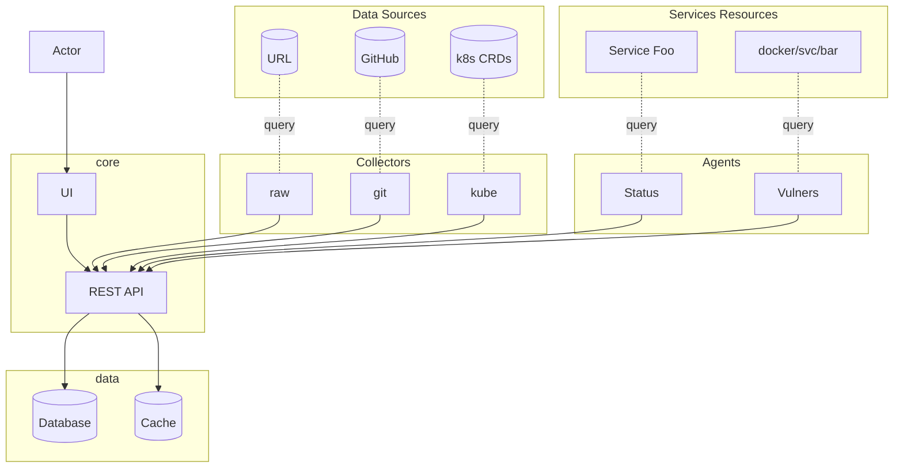

#  Greek

## Info

Greek is an service catalog.

Is was created to cover [single source of truth](https://en.wikipedia.org/wiki/Single_source_of_truth) gap for core infrastructure / platform teams.

Think of it as [service catalog](https://en.wikipedia.org/wiki/Service_catalog), capable to enrich data using integrations with Business, CI/CD and engineering platforms.

## Design

- **Collectors** - these are watchers, they keep service specs synchronized from desired data source

- **Agents** - proxy processes to gather data from third-party systems (e.g. metrics, logs, security scanners, ...) and thus provide additional data for UI dashboards

## Roadmap

Moved to [Trello board](https://trello.com/b/Xww1m2DX) [RU].

## Naming

Once an engineer asked for service catalog to be able to make company's culture better.

It was quite a reference to famous Archimedes quote:

>Give me a lever long enough and a fulcrum on which to place it, and I shall move the world.

Well, he was a Greek.
