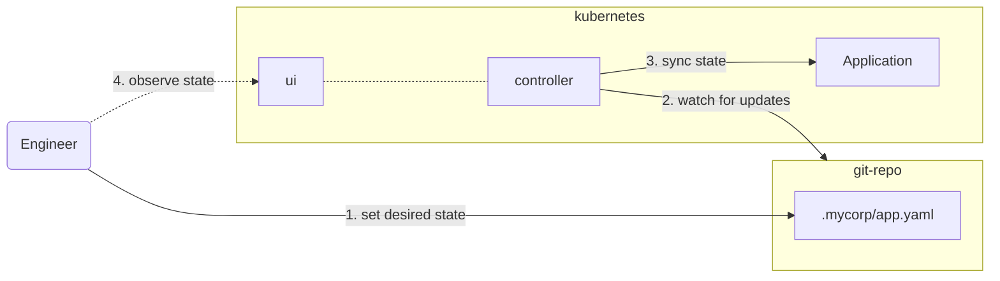

# MyCorp

## Info

MyCorp is a simple Internal Developer Platform.

## Design

```mermaid
graph LR
  engineer(Engineer)

  subgraph git-repo
    app.yaml[.mycorp/app.yaml]
  end

  subgraph kubernetes
    ui
    controller
    application[Application]
  end

  engineer --> |1. set desired state| app.yaml

  controller --> |2. watch for updates| git-repo
  controller --> |3. sync state| application

  engineer -.-> |4. observe state| ui -.- controller
```

## Roadmap

[GitHub Issues & Milestones](https://github.com/agrrh/mycorp/milestones)
